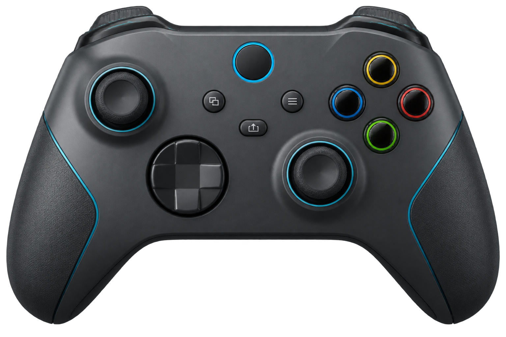

# Joy Harness

Joy Harness 是一套面向 macOS Codex Desktop 的实体控制方案：它把 Xbox 手柄（或其他被
macOS `GameController` 框架识别的扩展型手柄）变成 Codex Micro 控制器，同时用手柄震动
反馈 Codex 的运行状态。

这套方案由三部分组成：

1. **Joy Harness macOS 应用**：读取手柄输入、控制鼠标、播放震动，并提供六任务槽控制台。
2. **RP2040 固件**：让一块 Raspberry Pi Pico 兼容板在 USB 侧模拟 Codex Desktop 能识别的
   `Codex Micro`，再通过串口接收 Joy Harness 转发的手柄操作。
3. **Codex hooks 与 notify bridge**：把开始工作、等待审批、完成和失败等状态发送给
   Joy Harness，让你不盯着屏幕也能通过震动感知任务进度。

Xbox 手柄和 RP2040 都连接 Mac，二者之间**不需要接线**。Joy Harness 不启动或代理
Codex app-server，也不通过键盘模拟 Codex Micro；任务槽、审批、按住说话等 Codex 操作
最终都由 RP2040 的原生 Vendor HID 接口送入 Codex Desktop。



## 能达到什么效果

安装完成后，可以获得以下能力：

- **离开键盘操作 Codex**：用手柄在六个 Codex Micro 任务槽之间切换、打开当前任务、
  批准或拒绝权限请求、触发快捷操作和拆分任务。
- **按住说话**：按住 Menu 键时发送 Codex Micro `ACT10`，松开时结束，由 Codex Desktop
  原生完成录音和语音输入。
- **用手柄控制 macOS**：左摇杆移动鼠标，LT + 左摇杆滚动，A/B 负责左右键，R3 负责
  中键，X/Y 负责 Backspace 和 Esc。
- **用震动了解任务状态**：任务工作中、等待审批、完成或失败时使用不同节奏，尤其适合
  同时处理多个任务或暂时离开屏幕时使用。
- **管理六个任务槽**：LB/RB 顺序切换，或用 LT 组合键直接跳到 1–6 号槽位；切换后以
  对应次数的短震确认当前槽号。
- **可视化诊断**：macOS 控制台展示当前槽位、每个槽位最近状态、手柄与震动能力、
  RP2040 连接状态以及辅助功能授权状态，并可直接发送批准、拒绝、快捷操作和打开任务。
- **自定义按键**：在应用的“设置”中为基础按键、十字键和 LT 功能层分别选择鼠标、
  系统、Codex Micro、槽位控制或禁用操作；修改即时生效并自动保存。
- **后台常驻**：安装后由 LaunchAgent 登录即启动；手柄或 RP2040 中途断开、重新连接时
  会自动重新检测。

### 不同硬件组合的能力

| 当前条件 | 可以使用的能力 |
|---|---|
| 只有 Joy Harness 应用 | 查看控制台和本地状态，使用 CLI 测试状态流转 |
| 应用 + 手柄 | 鼠标、滚动、系统按键；支持震动的手柄还可接收任务状态反馈 |
| 应用 + RP2040 | 控制台可向 Codex Micro 发送任务槽和审批等操作 |
| 应用 + 手柄 + RP2040 | 完整体验：手柄控制 Codex、鼠标操作、按住说话和任务震动反馈 |
| 再启用 Codex hooks / notify | Codex 状态会自动同步到控制台和手柄震动，无需手动发送 |

## 工作原理

```text
Codex hooks / notify_fanout.py
        │ Unix socket：idle / busy / waiting / done / error
        ▼
Joy Harness macOS 应用 ── Core Haptics ──▶ 手柄震动
        ▲
        │ GameController
        └────────────────────────────────── Xbox / 兼容手柄

手柄操作 ──▶ Joy Harness ── USB CDC 串口 ──▶ RP2040
                                                │
                                                │ Vendor HID
                                                ▼
                                   Codex Desktop / Codex Micro

左摇杆、A/B/X/Y、R3 ──▶ Joy Harness ── CoreGraphics ──▶ macOS 前台应用
```

RP2040 固件同时暴露两个 USB 接口：

- `Codex Micro` Vendor HID：由 Codex Desktop 读取，传递任务槽、审批、按住说话和径向输入。
- `Joy Harness Bridge` USB CDC 串口：由 Joy Harness 使用，负责把手柄事件发送给 RP2040。

Joy Harness 只有在串口收到兼容握手 `READY agentdeck-rp2040` 后才认为桥接成功，因此不会
把其他 USB 串口设备误识别为 RP2040。握手名称保留旧项目名是为了兼容已经刷入的固件。

## 开始前的准备

### 必需的软件

| 项目 | 要求 | 用途 |
|---|---|---|
| macOS | 13.0 或更高 | SwiftUI、GameController、Core Haptics 和辅助功能接口 |
| Codex Desktop | 支持 Codex Micro 与 hooks 的版本 | 接收 RP2040 HID 输入并产生任务状态事件 |
| Xcode Command Line Tools | 提供 Swift 5.9+ 和 macOS SDK | 编译 Joy Harness macOS 应用 |
| Python | Python 3 | 运行本地状态 CLI、hook bridge 和 notify fan-out |
| Git | 可访问 GitHub | 首次构建固件时自动下载 Pico SDK 2.2.0 |

可以先检查本机环境：

```bash
xcode-select -p
swift --version
python3 --version
git --version
```

若没有 Xcode Command Line Tools：

```bash
xcode-select --install
```

### 必需的硬件

- 一台运行 macOS 的 Mac。
- 一只可被 macOS `GameController` 框架识别、具有 Extended Gamepad 布局的手柄。项目主要按
  Xbox Series 手柄设计；其他手柄能否完整映射取决于 macOS 是否提供对应按键与摇杆。
- 一块 RP2040 开发板，例如 Raspberry Pi Pico 或兼容板。
- 一根**支持数据传输**的 USB 线。只能充电的线无法刷写固件或创建串口/HID 设备。

手柄可以通过蓝牙或 USB 连接，但当前测试的 Xbox Series 手柄在 macOS 26.5.2 下只有
**蓝牙模式可以正常震动**；USB 模式虽可被系统识别，系统原生 Identify 也不会触发震动。
需要状态反馈时优先使用蓝牙。

### 构建 RP2040 固件所需工具

固件构建脚本使用 CMake、Ninja 和 ARM GCC。使用 Homebrew 安装：

```bash
brew install cmake ninja arm-none-eabi-gcc
```

`task` 只是项目命令的快捷入口，不是硬性依赖：

```bash
brew install go-task
task --version
```

不安装 `task` 也可以直接运行每一节列出的 Bash 脚本。

### 需要授予的系统权限

| 权限 | 授权对象 | 影响 |
|---|---|---|
| 辅助功能（Accessibility） | Joy Harness | 允许左摇杆移动/滚动鼠标，以及 A/B/X/Y/R3 发送鼠标或系统按键 |
| 输入监控（Input Monitoring） | Codex Desktop | 允许 Codex Desktop 接收 Codex Micro 的物理输入 |
| 麦克风 | Codex Desktop | 仅在使用原生按住说话时由 Codex Desktop 管理；Joy Harness 不申请麦克风权限 |

权限位置通常在“系统设置 → 隐私与安全性”。没有辅助功能权限时，Codex Micro 操作和震动
仍可工作，但鼠标、滚动、Backspace 和 Esc 不会生效。

## 从零安装

以下命令均在项目根目录执行。

### 1. 构建并刷入 RP2040

```bash
task firmware
# 不使用 task：bash scripts/build_rp2040_firmware.sh
```

首次执行会把 Pico SDK 2.2.0 下载到 `~/.agent-deck/toolchains/pico-sdk`，固件产物位于：

```text
firmware/rp2040/build/joy_harness_rp2040.uf2
```

按住开发板上的 `BOOTSEL` 键，将 RP2040 插入 Mac。Finder 中出现 `RPI-RP2` 磁盘后执行：

```bash
task flash
# 不使用 task：bash scripts/flash_rp2040_firmware.sh
```

UF2 文件复制完成后，RP2040 会自动重启并退出磁盘模式。

默认按 Raspberry Pi Pico 构建。如果兼容板需要其他 Pico SDK 板型：

```bash
PICO_BOARD=<board-name> task firmware
```

已有 Pico SDK 时可避免重复下载：

```bash
PICO_SDK_PATH=/absolute/path/to/pico-sdk task firmware
```

### 2. 安装 Joy Harness 与 Codex 集成

```bash
task install
# 不使用 task：bash scripts/install.sh
```

安装脚本会编译 release 应用、注册后台 LaunchAgent、合并 Codex hooks，并为现有 `notify`
配置创建 fan-out，避免覆盖原来的通知命令。详细文件改动见“安装会改动什么”。

### 3. 连接设备并重启 Codex

1. 通过蓝牙或 USB 连接手柄；若需要 Xbox 震动，优先使用蓝牙。
2. 保持刷好固件的 RP2040 通过数据线连接 Mac。
3. 完全退出 Codex Desktop 后重新打开，让它重新扫描 `Codex Micro` HID 设备。
4. 在系统设置中给 Joy Harness 授予辅助功能权限，给 Codex Desktop 授予输入监控权限。
5. 若 Codex 提示 hooks 信任变更，在 Codex 中使用 `/hooks` 检查并确认。
6. 若 `~/.codex/config.toml` 中显式设置过 `[features] hooks = false`，改回 `true`。

### 4. 验证安装结果

查看运行状态：

```bash
task status
# 或：cat ~/.agent-deck/status.json
```

完整链路正常时，至少应看到：

```json
{
  "accessibility": true,
  "haptics": true,
  "mode": "physical-codex-micro",
  "rp2040": true
}
```

其中 `haptics: false` 只表示当前手柄没有可用的 Core Haptics 引擎，不影响普通按键输入；
`accessibility: false` 不影响 RP2040/Codex Micro 操作，但会禁用鼠标和系统按键。

测试单个震动状态和完整震动序列：

```bash
~/.agent-deck/bin/joy-harness-send waiting
task demo
```

最后在 Codex Desktop 中打开一个任务，依次验证：

1. 提交提示词后手柄进入低频轻震。
2. 出现权限请求时变为急促脉冲。
3. 按 `LT + A` 批准，或按 `LT + B` 拒绝。
4. 任务结束时收到两下短震，然后自动回到 idle。
5. 使用 LB/RB 切换任务槽，并通过短震次数确认槽号。

## 手柄按键与实际效果

可以从 macOS 菜单栏打开 `Joy Harness > 设置`，或点击控制映射区域的齿轮按钮，自定义每个
数字按键和 LT 组合键。设置保存在当前用户的偏好设置中；“恢复默认映射”可还原下表行为。
Options / View 与 Home 只有在手柄驱动通过 macOS `GameController` 暴露对应事件时才会生效。

### 鼠标和系统控制

| 按键 | 实际效果 | 是否需要辅助功能权限 |
|---|---|---|
| 左摇杆 | 以 120Hz 平滑移动 macOS 鼠标，带死区和渐进加速 | 是 |
| LT + 左摇杆 | 上下纵向滚动、左右横向滚动，摇杆幅度控制速度 | 是 |
| L3 按住 | 鼠标速度临时提升到 `1.8x`，松开恢复精细速度 | 是 |
| A 按下 / 松开 | 鼠标左键按下 / 松开，可单击、长按或拖动 | 是 |
| B 按下 / 松开 | 鼠标右键按下 / 松开，可右击或拖动 | 是 |
| R3 按下 / 松开 | 鼠标中键按下 / 松开 | 是 |
| X | Backspace；按住后按系统节奏连续删除 | 是 |
| Y | Esc | 是 |

这些操作发给当前前台应用，不只限于 Codex Desktop。LT 是功能修饰键：按住 LT 时左摇杆
改为滚动，A/B/X/Y 改为 Codex Micro 操作，不再发送鼠标或系统按键。

### Codex Micro 控制

| 按键 | Micro 输入 | 实际效果 |
|---|---|---|
| LT + A | `ACT07` | 批准当前权限请求 |
| LT + B | `ACT08` | 拒绝当前权限请求 |
| LT + X | `ACT06` | 触发 Codex 快捷操作 |
| LT + Y | `ACT09` | 拆分任务 |
| LB / RB | `AG00`–`AG05` | 切换到上一个 / 下一个任务槽，首尾循环 |
| LT + 上 / 左 / 下 / 右 | `AG00`–`AG03` | 逆时针直接选择任务槽 1 / 2 / 3 / 4 |
| LT + LB / RB | `AG04` / `AG05` | 直接选择任务槽 5 / 6 |
| Menu 按住 / 松开 | `ACT10` 按下 / 松开 | Codex Desktop 原生按住说话 |
| RT | `ACT12` | 默认聚焦 Codex Desktop |
| 十字键（未按 LT）/ 右摇杆 | `v.oai.rad` | 发送角度和力度形式的径向输入 |

LB/RB 和 LT 组合键直接操作 Codex Desktop 自己管理的六个 Micro 槽位。Joy Harness 只记录
当前槽号和最近一次状态，不维护第二份任务列表，也不会把任务正文写入本地状态文件。

### Codex 状态与震动

| Codex 事件 | 状态 | 手柄反馈 |
|---|---|---|
| `SessionStart` / `SessionEnd` | `idle` | 静止 |
| `UserPromptSubmit` / `PreToolUse` / `PostToolUse` | `busy` | 每约 0.85 秒一次低频轻震 |
| `SubagentStart` / `SubagentStop` | `busy` | 继续低频轻震 |
| `PermissionRequest` | `waiting` | 每约 0.45 秒一次明显的急促脉冲 |
| `Stop` / `agent-turn-complete` | `done` | 两下短震，约 1.2 秒后自动回到 idle |
| 手动发送或内部失败 | `error` | 三下重震，约 1.2 秒后自动回到 idle |

手柄在任务进行中才连接时，Joy Harness 会恢复当前槽位对应的震动状态。切换槽位时会先用
1–6 下短震报告槽号；如果目标槽位仍为 `busy` 或 `waiting`，随后继续播放该状态的节奏。

## macOS 控制台

Joy Harness 是带窗口的后台应用。关闭窗口不会结束进程，LaunchAgent 也会保持它运行。
控制台提供：

- 六个槽位及每个槽位最近记录的 `idle`、`busy`、`waiting`、`done`、`error` 状态。
- 当前槽位的状态横幅和完整手柄映射。
- 手柄名称、震动是否可用、RP2040 是否连接、当前是否为物理 Codex Micro 模式。
- 辅助功能权限诊断。
- 批准、拒绝、快捷操作、打开任务和震动状态测试按钮。

控制台中的任务命令同样依赖 RP2040 已连接。当前版本不会从 Codex app-server 拉取任务标题
或正文，因此空标题会显示为“Micro 槽位”；状态是当前会话内按槽位记录的最近事件。

## 常用命令

| 命令 | 用途 |
|---|---|
| `task build` | 编译 release 版 macOS 可执行文件 |
| `task run` | 用 SwiftPM 在前台运行 Joy Harness |
| `task install` | 编译、安装应用、注册 LaunchAgent 并接入 Codex |
| `task firmware` | 构建 RP2040 UF2 固件 |
| `task flash` | 将固件复制到处于 BOOTSEL 模式的 RP2040 |
| `task status` | 输出 `~/.agent-deck/status.json` |
| `task send -- waiting` | 手动发送一个状态 |
| `task demo` | 顺序演示全部震动状态 |
| `task test` | 运行 Swift 与 Python 测试 |

CLI 也支持检查 daemon 和操作槽位：

```bash
python3 bin/joy-harness-send ping
python3 bin/joy-harness-send status
python3 bin/joy-harness-send --action slot-next
python3 bin/joy-harness-send --action slot-previous
python3 bin/joy-harness-send --action slot-open
python3 bin/joy-harness-send error --note manual-test
```

## 前台开发与调试

不使用 LaunchAgent，构建 `.app` 后直接打开：

```bash
./script/build_and_run.sh
```

其他调试模式：

```bash
./script/build_and_run.sh --verify
./script/build_and_run.sh --logs
./script/build_and_run.sh --debug
```

注意：该脚本会先停止已安装的 Joy Harness / AgentDeck LaunchAgent 和进程，以避免多个实例
争用同一个 Unix socket 或 RP2040 串口。调试结束后可再次运行 `task install` 恢复后台服务。

Codex Desktop 会读取项目的 `.codex/environments/environment.toml`，也可以直接使用项目的
**Run** 操作构建并打开控制台。

## 安装会改动什么

`scripts/install.sh` 会进行以下本机修改：

| 路径 | 内容 |
|---|---|
| `~/.agent-deck/Joy Harness.app` | 临时签名的 Joy Harness 应用 |
| `~/Library/LaunchAgents/tech.joyharness.daemon.plist` | 登录启动并保持运行的 LaunchAgent |
| `~/.agent-deck/bin/` | 应用入口、CLI、hook bridge 和 notify fan-out |
| `~/.local/bin/joy-harness-send` | 指向已安装 CLI 的符号链接 |
| `~/.codex/hooks.json` | 合并 Joy Harness hooks，保留其他已有 hook |
| `~/.codex/config.toml` | 将 `notify` 指向 fan-out，原 notify 链仍会继续执行 |
| `~/.agent-deck/notify-chain.json` | 安装前的 Codex notify 命令 |
| `~/.agent-deck/status.json` | 当前连接、权限、槽位和状态快照 |
| `~/.agent-deck/pad.sock` | hook、CLI 与应用通信的本地 Unix socket，权限为 `0600` |
| `~/.agent-deck/daemon.log` | 后台运行日志 |

第一次修改现有配置时还会创建：

- `~/.codex/hooks.json.bak-agentdeck`
- `~/.codex/config.toml.bak-agentdeck`

为兼容旧版，安装脚本保留 `agent-deck-send` 和 `AgentDeck` 入口别名，并迁移/移除旧的
`tech.agentdeck.daemon`、`tech.codexpad.daemon` LaunchAgent。运行目录继续使用
`~/.agent-deck`，避免升级时丢失已有配置和通知链。

## 常见问题

### `task firmware` 提示缺少工具或找不到 Ninja

```bash
brew install cmake ninja arm-none-eabi-gcc
```

然后确认 `cmake`、`ninja`、`arm-none-eabi-gcc` 都在 `PATH` 中。

### `task flash` 提示找不到 `RPI-RP2`

拔下 RP2040，按住 `BOOTSEL` 再插入，看到 Finder 中的 `RPI-RP2` 磁盘后重试。仍然没有
磁盘时，优先更换一根确认支持数据传输的 USB 线。

### `status.json` 中 `rp2040` 一直是 `false`

确认固件已刷入、开发板已经退出 BOOTSEL 磁盘模式，并检查日志：

```bash
tail -f ~/.agent-deck/daemon.log
ls /dev/cu.usbmodem* /dev/cu.usbserial* 2>/dev/null
```

如果系统有多个串口，可以临时指定：

```bash
AGENT_DECK_RP2040_PORT=/dev/cu.usbmodemXXXX task run
```

### 手柄有输入但没有震动

- 确认 `status.json` 中 `haptics` 为 `true`。
- Xbox Series 手柄优先改用蓝牙连接。
- 运行 `~/.agent-deck/bin/joy-harness-send waiting` 排除 Codex hook 问题。
- 查看 `daemon.log` 中是否出现 `no haptic engine` 或 `rumble skipped`。

### Codex 状态没有自动同步

- 确认 Joy Harness daemon 正在运行，`~/.agent-deck/pad.sock` 存在。
- 检查 `~/.codex/hooks.json` 是否包含已安装的 `hook_bridge.py`。
- 检查 `[features] hooks` 没有被设为 `false`。
- 修改 hooks 后完全重启 Codex Desktop，并使用 `/hooks` 完成信任确认。
- `notify` 已有自定义命令时，确认 `~/.agent-deck/notify-chain.json` 中保留了原命令。

### 摇杆不能控制鼠标

在“系统设置 → 隐私与安全性 → 辅助功能”中允许 Joy Harness，然后重新启动应用。该权限只
影响鼠标、滚动、Backspace 和 Esc，不影响通过 RP2040 发送的 Codex Micro 操作。

### Codex 收不到任务槽或审批按键

- 确认 `rp2040` 为 `true`。
- 完全退出并重启 Codex Desktop，让它重新扫描 HID。
- 在“输入监控”中允许 Codex Desktop。
- 确认当前 Codex Desktop 版本支持原生 Codex Micro。

## 项目结构

```text
Sources/JoyHarness/             macOS 应用、控制台、手柄、鼠标、震动和串口桥
Sources/JoyHarness/Resources/   控制台图片资源
firmware/rp2040/                RP2040 Codex Micro 固件与 USB 描述符
bin/joy-harness-send            本地 Unix socket CLI
codex-hooks/hook_bridge.py      Codex hook 事件到状态的映射
codex-hooks/notify_fanout.py    保留原 notify 的完成通知分发器
scripts/install.sh              release 构建、安装、配置合并和 LaunchAgent 注册
scripts/build_rp2040_firmware.sh
scripts/flash_rp2040_firmware.sh
script/build_and_run.sh         前台 `.app` 构建与调试入口
tests/                          Swift 和 Python 测试
Taskfile.yml                    常用任务入口
```

## 当前边界

- 项目依赖 macOS 专有的 GameController、Core Haptics、SwiftUI 和 CoreGraphics，不支持
  Windows 或 Linux。
- 手柄灯光没有 macOS 公共控制 API，因此状态反馈只使用震动。
- `PermissionRequest` hook 只负责发送 `waiting` 状态；实际批准和拒绝由 Codex Desktop 的
  Codex Micro 处理。
- Joy Harness 不读取任务正文，也不持有 Codex 会话数据；六个槽位的权威状态仍由
  Codex Desktop 管理。
- 没有手柄时 daemon 仍会运行并更新 `status.json`；震动请求会在日志中标记为 skipped。
- 按住说话完全由 Codex Desktop 管理，Joy Harness 本身不录音。
