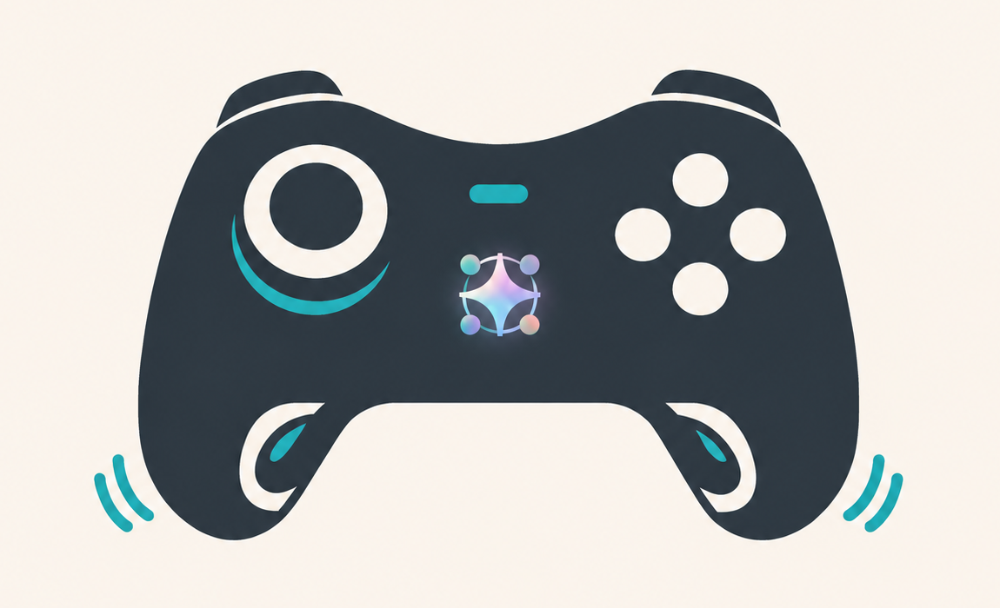
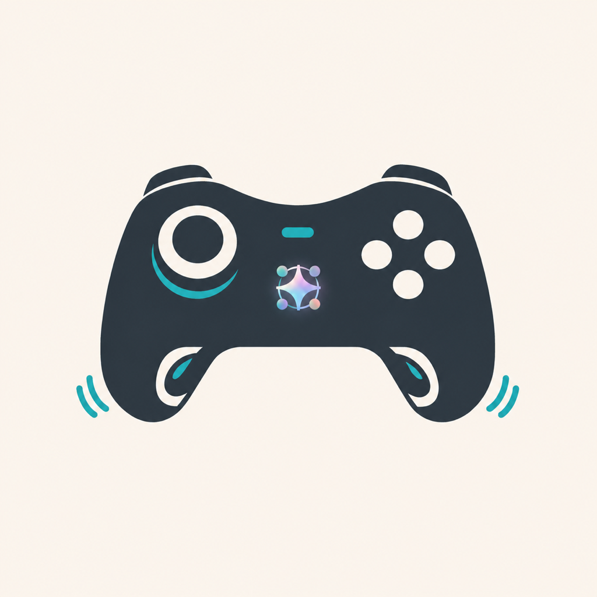
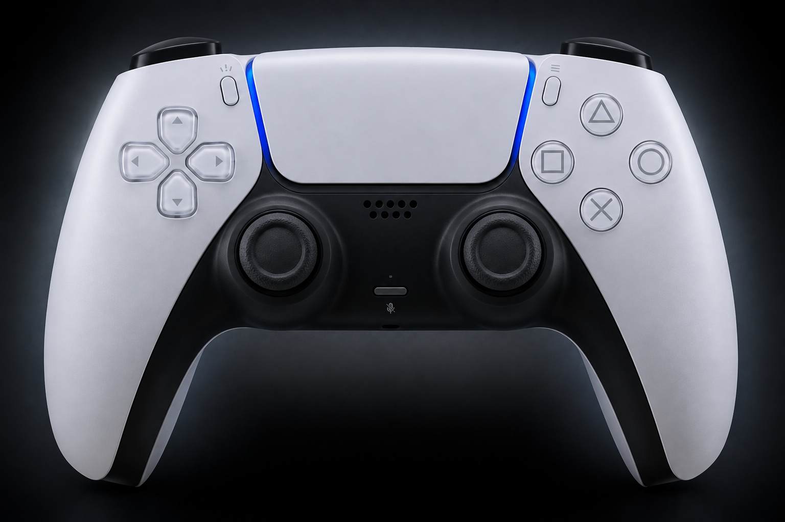

<p align="center">
  
</p>

<h1 align="center">Joy Harness</h1>

<p align="center">
  
</p>

Joy Harness 是一套面向 macOS Codex Desktop 的实体控制方案。它把 PS5 DualSense、Xbox
等被 macOS `GameController` 框架识别的扩展型手柄，连接到鼠标与系统快捷键、六个 Codex
Micro 任务槽、权限审批和按住说话，并提供操作确认震动与本地诊断界面。

这套方案由两部分组成：

1. **Joy Harness macOS 应用**：读取手柄输入、控制鼠标、播放震动，并提供六任务槽控制台。
2. **RP2040 固件**：让一块 Raspberry Pi Pico 兼容板在 USB 侧模拟 Codex Desktop 能识别的
   `Codex Micro`，再通过串口接收 Joy Harness 转发的手柄操作。

手柄和 RP2040 都连接 Mac，二者之间**不需要接线**。Joy Harness 会启动一个只读的 Codex
app-server 子进程获取任务名称和顺序，但不代理 Codex 操作，也不通过键盘模拟 Codex Micro；
任务槽、审批、按住说话等操作最终都由 RP2040 的原生 Vendor HID 接口送入 Codex Desktop。
鼠标、回车、复制、粘贴和截图等系统操作则直接发送给当前前台应用。

## 下载

当前版本为 **v0.2.0**，支持 Apple Silicon Mac（arm64）和 macOS 13.0 或更高版本：

- [下载 Joy-Harness-v0.2.0-macOS-arm64.dmg](https://github.com/nixihz/JoyHarness/releases/download/v0.2.0/Joy-Harness-v0.2.0-macOS-arm64.dmg)
- [下载 SHA-256 校验文件](https://github.com/nixihz/JoyHarness/releases/download/v0.2.0/Joy-Harness-v0.2.0-macOS-arm64.dmg.sha256)
- [查看 v0.2.0 Release](https://github.com/nixihz/JoyHarness/releases/tag/v0.2.0)

DMG 只包含可手动启动的 `Joy Harness.app`。如需登录时自动启动、本地 CLI，或需要构建和
刷写 RP2040 固件，请使用下方的[源码安装](#从零安装)。当前 v0.2.0 Release 使用 ad-hoc
签名且未经 Apple 公证，首次打开可能需要右键选择“打开”，或在“系统设置 → 隐私与安全性”
中允许。校验下载文件：

```bash
shasum -a 256 -c Joy-Harness-v0.2.0-macOS-arm64.dmg.sha256
```

## v0.2.0 更新

- 新增 `LT + RT` 回车、`LT + L3/R3` 复制/粘贴，以及 Options/View 飞书截图快捷键。
- 控制台改为更紧凑的三栏布局，并统一展示应用版本和链路健康状态。
- 应用版本集中由 `VERSION` 资源管理，应用、安装脚本和 DMG 使用同一个版本号。
- Xbox RT 提供 Impulse Trigger 分级反馈；DualSense R2 使用自适应扳机阻力墙。
- 简体中文和 English 界面可跟随系统，也可在设置中手动切换。




## 能达到什么效果

安装完成后，可以获得以下能力：

- **离开键盘操作 Codex**：用手柄在六个 Codex Micro 任务槽之间切换、打开当前任务、
  批准或拒绝权限请求，以及输入 `yes` / `no`；Fast 模式和拆分任务仍可配置为自定义映射。
- **按住说话**：按住 Menu/Options 键时发送 Codex Micro `ACT10`，松开时结束；DualSense
  还可用触控板按键。录音仍由 Codex Desktop 原生完成。
- **DualSense 语音诊断**：检测通过 USB 暴露的手柄麦克风，并提示它是否已被设为 macOS
  默认输入；Joy Harness 不抢占录音设备，也不改动全局声音设置。
- **DualSense R2 强反馈**：R2 轻触时给一次轻震，中段形成明显阻力墙，完全按下越过触发点
  时释放阻力并补一次短促强震，形成分级的操作确认。
- **用手柄控制 macOS**：左摇杆移动鼠标，LT + 左摇杆滚动，A/B 负责左右键，R3 负责
  中键，X/Y 负责 Backspace 和 Esc；LT 功能层还提供回车、复制和粘贴。
- **管理六个任务槽**：LB/RB 顺序切换，或用 LT 组合键直接跳到 1–6 号槽位；切换后以
  对应次数的短震确认当前槽号。
- **可视化诊断**：macOS 控制台展示当前槽位、手柄电量与震动能力、
  RP2040 连接状态以及辅助功能授权状态，并可打开当前任务。
- **自定义按键**：在应用的“设置”中为基础按键、十字键和 LT 功能层分别选择鼠标、
  系统、Codex Micro、槽位控制或禁用操作；修改即时生效并自动保存。
- **中英文界面**：默认跟随 macOS 首选语言，中文系统显示简体中文，其他语言显示英语；
  也可在应用“设置”中手动固定为简体中文或 English，选择会自动保存。
- **后台常驻**：安装后由 LaunchAgent 登录即启动；手柄或 RP2040 中途断开、重新连接时
  会自动重新检测。

### 不同硬件组合的能力

| 当前条件 | 可以使用的能力 |
|---|---|
| 只有 Joy Harness 应用 | 查看控制台和本地状态，使用 CLI 进行诊断 |
| 应用 + 手柄 | 鼠标、滚动、系统按键、槽位确认震动和手动震动测试 |
| 应用 + RP2040 | 通过控制台选择或打开 Codex Micro 任务槽；无手柄时不能使用手柄审批操作 |
| 应用 + 手柄 + RP2040 | 完整体验：手柄控制 Codex、鼠标操作、按住说话和操作确认震动 |

## 工作原理

```text
Joy Harness macOS 应用 ── Core Haptics ──▶ 手柄震动
        ▲
        │ GameController
        └────────────────────────────────── DualSense / Xbox / 兼容手柄

手柄操作 ──▶ Joy Harness ── USB CDC 串口 ──▶ RP2040
                                                │
                                                │ Vendor HID
                                                ▼
                                   Codex Desktop / Codex Micro

左摇杆、A/B/X/Y、R3 ──▶ Joy Harness ── CoreGraphics ──▶ macOS 前台应用
```

RP2040 固件同时暴露两个 USB 接口：

- `Codex Micro` Vendor HID：由 Codex Desktop 读取，传递任务槽、审批、按住说话和径向输入。
- `Joy Harness Bridge` USB CDC 串口：由 Joy Harness 使用，负责把手柄事件发送给 RP2040。

Joy Harness 只有在串口收到兼容握手 `READY agentdeck-rp2040` 后才认为桥接成功，因此不会
把其他 USB 串口设备误识别为 RP2040。握手名称保留旧项目名是为了兼容已经刷入的固件。

## 开始前的准备

### 源码安装所需软件

直接下载 DMG 使用时不需要 Xcode、Python 或 Git。只有从源码安装、使用 CLI 或构建固件时
才需要下列工具。

| 项目 | 要求 | 用途 |
|---|---|---|
| macOS | 13.0 或更高 | SwiftUI、GameController、Core Haptics 和辅助功能接口 |
| Codex Desktop | 支持 Codex Micro 的版本 | 接收 RP2040 Vendor HID 输入 |
| Xcode Command Line Tools | 提供 Swift 5.9+ 和 macOS SDK | 编译 Joy Harness macOS 应用 |
| Python | Python 3 | 运行本地状态与诊断 CLI |
| Git | 可访问 GitHub | 首次构建固件时自动下载 Pico SDK 2.2.0 |

可以先检查本机环境：

```bash
xcode-select -p
swift --version
python3 --version
git --version
```

若没有 Xcode Command Line Tools：

```bash
xcode-select --install
```

### 完整体验所需硬件

只使用鼠标、系统快捷键、控制台和手动震动时，可以不连接 RP2040；要控制 Codex Micro
任务槽、审批和按住说话，则需要完整硬件链路。

- 一台运行 macOS 的 Mac。
- 一只可被 macOS `GameController` 框架识别、具有 Extended Gamepad 布局的手柄。项目原生
  适配 PS5 DualSense、PS4 DualShock 4 和 Xbox Series 手柄；其他手柄可使用标准按键、
  摇杆与十字键，具体能力取决于 macOS 暴露的输入与震动接口。
- 一块 RP2040 开发板，例如 Raspberry Pi Pico 或兼容板。
- 一根**支持数据传输**的 USB 线。只能充电的线无法刷写固件或创建串口/HID 设备。

手柄可以通过蓝牙或 USB 连接，但当前测试的 Xbox Series 手柄在 macOS 26.5.2 下只有
**蓝牙模式可以正常震动**；USB 模式虽可被系统识别，系统原生 Identify 也不会触发震动。
需要状态反馈时优先使用蓝牙。

DualSense 的标准按键、触控板按键和震动由 Apple 的 `GCDualSenseGamepad` / Core Haptics
接口支持。若要使用手柄内置麦克风，应通过支持数据传输的 USB 线连接，并在“系统设置 →
声音 → 输入”中选择 `DualSense Wireless Controller` 或 `Wireless Controller`。这里的
`Wireless` 是产品名，不代表音频正在走无线；Joy Harness 会另外显示真实的 `USB` 传输。
蓝牙模式只提供手柄 HID 输入，不会向 macOS 发布麦克风音频设备，软件无法从不存在的音频
端点采集声音。若希望手柄保持无线，可继续用 Options/触控板触发按住说话，并把 Codex 的
录音输入设为 Mac 内置麦克风、AirPods 或其他无线麦克风；控制台会显示当前系统默认输入。
DualSense 的实体静音键没有公开的 GameController 事件，是否静音由手柄固件和系统音频设备
自行管理。

DualSense 的 R2 使用系统公开的自适应扳机接口：进入约 8% 行程时先轻震一次，前 35% 为
自由行程，35%–72% 提供最高 90% 的阻力，越过 72% 后突然释放并触发一次强震。快速直接
按到底时会跳过轻震，避免反馈重叠；松开到 18% 以下会重新待命。此反馈只在
DualSense 上启用，不改变 Xbox、DualShock 4 或通用手柄的 RT/R2 输入行为。Xbox 的 RT
使用 Impulse Trigger 细微震动：进入约 8% 行程时轻触提示一次，越过 72% 并向 Codex Micro
发送 `ACT12` 时再确认一次；松开到 18% 以下后重新待命。macOS 暴露 `.rightTrigger` locality
时反馈只在 RT 马达播放，否则回退为更轻的全手柄震动。macOS 会在
Joy Harness 退到后台时关闭 GameController 的扳机效果；USB 连接的 DualSense 会通过原始
HID 输出自动恢复，因此在 Codex Desktop 前台也能保持阻力。蓝牙连接暂不支持后台恢复。

### 构建 RP2040 固件所需工具

固件构建脚本使用 CMake、Ninja 和 ARM GCC。使用 Homebrew 安装：

```bash
brew install cmake ninja arm-none-eabi-gcc
```

`task` 只是项目命令的快捷入口，不是硬性依赖：

```bash
brew install go-task
task --version
```

不安装 `task` 也可以直接运行每一节列出的 Bash 脚本。

### 需要授予的系统权限

| 权限 | 授权对象 | 影响 |
|---|---|---|
| 辅助功能（Accessibility） | Joy Harness | 允许发送鼠标、回车、复制、粘贴、截图和其他系统按键 |
| 输入监控（Input Monitoring） | Joy Harness | 允许应用退到后台后继续接收手柄输入 |
| 输入监控（Input Monitoring） | Codex Desktop | 允许 Codex Desktop 接收 Codex Micro 的物理输入 |
| 麦克风 | Codex Desktop | 仅在使用原生按住说话时由 Codex Desktop 管理；Joy Harness 不申请麦克风权限 |

权限位置通常在“系统设置 → 隐私与安全性”。没有辅助功能权限时，Codex Micro 操作和震动
仍可工作，但鼠标和所有系统快捷键不会生效。

## 从零安装

以下命令均在项目根目录执行。

### 1. 构建并刷入 RP2040

```bash
task firmware
# 不使用 task：bash scripts/build_rp2040_firmware.sh
```

首次执行会把 Pico SDK 2.2.0 下载到 `~/.agent-deck/toolchains/pico-sdk`，固件产物位于：

```text
firmware/rp2040/build/joy_harness_rp2040.uf2
```

按住开发板上的 `BOOTSEL` 键，将 RP2040 插入 Mac。Finder 中出现 `RPI-RP2` 磁盘后执行：

```bash
task flash
# 不使用 task：bash scripts/flash_rp2040_firmware.sh
```

UF2 文件复制完成后，RP2040 会自动重启并退出磁盘模式。

默认按 Raspberry Pi Pico 构建。如果兼容板需要其他 Pico SDK 板型：

```bash
PICO_BOARD=<board-name> task firmware
```

已有 Pico SDK 时可避免重复下载：

```bash
PICO_SDK_PATH=/absolute/path/to/pico-sdk task firmware
```

### 2. 从源码安装 Joy Harness

```bash
task install
# 不使用 task：bash scripts/install.sh
```

安装脚本会编译 release 应用并注册后台 LaunchAgent。从旧版升级时，脚本还会移除
Joy Harness 旧的 Codex hooks 和 `notify` fan-out，但会保留其他工具的 Hook 和通知配置。
部署或开发启动前会按完整应用路径停止所有旧 Joy Harness / AgentDeck 实例，确认退出后再启动
唯一的新实例，避免多个应用争抢手柄和 Unix socket。应用本身也持有跨副本的进程锁；即使
从其他目录手动打开旧副本，后启动的实例也会立即退出。

### 3. 连接设备并重启 Codex

1. 通过蓝牙或 USB 连接手柄；Xbox 震动优先使用蓝牙，DualSense 内置麦克风使用 USB。
2. 保持刷好固件的 RP2040 通过数据线连接 Mac。
3. 完全退出 Codex Desktop 后重新打开，让它重新扫描 `Codex Micro` HID 设备。
4. 在系统设置中给 Joy Harness 授予辅助功能权限，给 Codex Desktop 授予输入监控权限。

### 4. 验证安装结果

查看运行状态：

```bash
task status
# 或：cat ~/.agent-deck/status.json
```

完整链路正常时，至少应看到：

```json
{
  "accessibility": true,
  "haptics": true,
  "mode": "physical-codex-micro",
  "rp2040": true
}
```

其中 `haptics: false` 只表示当前手柄没有可用的 Core Haptics 引擎，不影响普通按键输入；
`accessibility: false` 不影响 RP2040/Codex Micro 操作，但会禁用鼠标和系统按键。
控制台的“语音输入”会显示检测到的 DualSense 音频设备，并标记它是否为系统默认输入。

测试单个震动状态和完整震动序列：

```bash
~/.agent-deck/bin/joy-harness-send waiting
task demo
```

最后在 Codex Desktop 中打开一个任务，依次验证：

1. 按 `LT + A` 批准，或按 `LT + B` 拒绝。
2. 使用 LB/RB 切换任务槽，并通过短震次数确认槽号。
3. 按住 Menu/Options 使用 Codex Desktop 的原生按住说话。

## 手柄按键与实际效果

可以从 macOS 菜单栏打开 `Joy Harness > 设置`，或点击控制映射区域的齿轮按钮，自定义每个
数字按键和 LT 组合键。设置保存在当前用户的偏好设置中；“恢复默认映射”可还原下表行为。
同一设置窗口顶部可以选择“跟随系统”“简体中文”或 `English`；手动选择会覆盖系统语言。
Options / View 与 Home 只有在手柄驱动通过 macOS `GameController` 暴露对应事件时才会生效。

### 鼠标和系统控制

| 按键 | 实际效果 | 是否需要辅助功能权限 |
|---|---|---|
| 左摇杆 | 以 120Hz 平滑移动 macOS 鼠标，带死区和渐进加速 | 是 |
| LT + 左摇杆 | 上下纵向滚动、左右横向滚动，摇杆幅度控制速度 | 是 |
| L3 按住 | 鼠标速度临时提升到 `1.8x`，松开恢复精细速度 | 是 |
| A 按下 / 松开 | 鼠标左键按下 / 松开，可单击、长按或拖动 | 是 |
| B 按下 / 松开 | 鼠标右键按下 / 松开，可右击或拖动 | 是 |
| R3 按下 / 松开 | 鼠标中键按下 / 松开 | 是 |
| X | Backspace；按住后按系统节奏连续删除 | 是 |
| Y | Esc | 是 |
| Xbox：LT + RT；PlayStation：L2 + R2 | 普通回车（Enter） | 是 |
| LT + L3 | 复制（`Command-C`） | 是 |
| LT + R3 | 粘贴（`Command-V`） | 是 |
| Xbox：Options / View；PlayStation：Create | 飞书截图（`Command-Shift-A`） | 是 |
| 十字键上按下 / 松开 | 右侧 Command 按下 / 松开；默认用于唤起按住说话类语音输入工具 | 是 |

这些操作发给当前前台应用，不只限于 Codex Desktop。LT 是功能修饰键：按住 LT 时左摇杆
改为滚动，L3/R3 执行复制/粘贴。Xbox 的 `Options / View`、PlayStation 的 `Create` 当前
默认单按触发飞书截图；如果手柄驱动未向 macOS 暴露该键，可在设置中把“飞书截图”改配到
其他按键。该功能要求飞书正在运行，并将截图快捷键设置为 `Command-Shift-A`。

### Codex Micro 控制

| 按键 | Micro 输入 | 实际效果 |
|---|---|---|
| Xbox：LT + A；PlayStation：L2 + × | `ACT07` | 批准当前权限请求 |
| Xbox：LT + B；PlayStation：L2 + ○ | `ACT08` | 拒绝当前权限请求 |
| Xbox：LT + Y；PlayStation：L2 + △ | 键盘输入 | 在当前输入框填入 `yes`，不自动提交 |
| Xbox：LT + X；PlayStation：L2 + □ | 键盘输入 | 在当前输入框填入 `no`，不自动提交 |
| LB / RB | `AG00`–`AG05` | 切换到上一个 / 下一个任务槽，首尾循环 |
| LT + 上 / 左 / 下 / 右 | `AG00`–`AG03` | 逆时针直接选择任务槽 1 / 2 / 3 / 4 |
| LT + LB / RB | `AG04` / `AG05` | 直接选择任务槽 5 / 6 |
| Menu / Options 按住 / 松开 | `ACT10` 按下 / 松开 | Codex Desktop 原生按住说话 |
| DualSense / DualShock 触控板按住 / 松开 | `ACT10` 按下 / 松开 | PlayStation 手柄的备用按住说话入口 |
| RT / R2 扣过阻力墙 | `ACT12` | 到达确认行程后聚焦 Codex Desktop；轻按不会触发 |
| 十字键左 / 下 / 右（未按 LT）及右摇杆 | `v.oai.rad` | 发送角度和力度形式的径向输入；十字键上默认映射为右侧 Command |

右侧 Command 与其他系统操作一样，也可在“设置”的任意可映射按键菜单中选择；修改后会
即时生效并保存。升级前仍使用默认径向输入的十字键上会自动迁移为右侧 Command，自定义为
其他操作的映射保持不变。

LB/RB 和 LT 组合键直接操作 Codex Desktop 自己管理的六个 Micro 槽位。Joy Harness 通过
Codex app-server 的只读 `thread/list` 获取六个最近任务的名称和顺序；本地状态文件只保存用于
槽位展示的名称，未命名任务会保存首条消息摘要，不保存完整会话正文。

### 震动反馈

| 操作 | 手柄反馈 |
|---|---|
| 切换任务槽 | 用 1–6 下短震报告当前槽号 |
| RT / R2 越过触发行程 | 执行分级手感和短促确认震动 |
| 控制台或 CLI 手动测试 | 播放 `busy`、`waiting`、`done` 或 `error` 的诊断节奏 |

Joy Harness 不订阅 Codex 任务生命周期，也不会根据任务开始、等待审批或完成自动播放震动。

## macOS 控制台

Joy Harness 是带窗口的后台应用。关闭窗口不会结束进程，LaunchAgent 也会保持它运行。
控制台提供：

- 六个槽位、当前槽位和完整手柄映射。
- 手柄名称、震动是否可用、RP2040 是否连接、当前是否为物理 Codex Micro 模式。
- 辅助功能权限诊断。
- 打开当前任务和震动状态测试按钮。

控制台中的任务命令同样依赖 RP2040 已连接。任务名称来自 Codex app-server；未命名任务会
回退显示首条消息摘要。

## 常用命令

| 命令 | 用途 |
|---|---|
| `task build` | 编译 release 版 macOS 可执行文件 |
| `task dmg -- 0.2.0` | 构建版本化 macOS DMG 和 SHA-256 校验文件 |
| `task run` | 用 SwiftPM 在前台运行 Joy Harness |
| `task install` | 编译、安装应用并注册 LaunchAgent |
| `task firmware` | 构建 RP2040 UF2 固件 |
| `task flash` | 将固件复制到处于 BOOTSEL 模式的 RP2040 |
| `task status` | 输出 `~/.agent-deck/status.json` |
| `task send -- waiting` | 手动发送一个状态 |
| `task demo` | 顺序演示全部震动状态 |
| `task test` | 运行 Swift 与 Python 测试 |

CLI 也支持检查 daemon 和操作槽位：

```bash
python3 bin/joy-harness-send ping
python3 bin/joy-harness-send status
python3 bin/joy-harness-send --action slot-next
python3 bin/joy-harness-send --action slot-previous
python3 bin/joy-harness-send --action slot-open
python3 bin/joy-harness-send error --note manual-test
```

## 前台开发与调试

不使用 LaunchAgent，构建 `.app` 后直接打开：

```bash
./scripts/build_and_run.sh
```

其他调试模式：

```bash
./scripts/build_and_run.sh --verify
./scripts/build_and_run.sh --logs
./scripts/build_and_run.sh --debug
```

注意：该脚本会先停止已安装的 Joy Harness / AgentDeck LaunchAgent 和进程，以避免多个实例
争用同一个 Unix socket 或 RP2040 串口。调试结束后可再次运行 `task install` 恢复后台服务。

Codex Desktop 会读取项目的 `.codex/environments/environment.toml`，也可以直接使用项目的
**Run** 操作构建并打开控制台。

## 创建 DMG

构建适用于当前 Mac 架构的发布镜像：

```bash
task dmg -- 0.2.0
# 或：bash scripts/package_dmg.sh 0.2.0
```

产物会写入 `dist/`：

```text
Joy-Harness-v0.2.0-macOS-arm64.dmg
Joy-Harness-v0.2.0-macOS-arm64.dmg.sha256
```

DMG 内包含 `Joy Harness.app` 和指向 `/Applications` 的快捷方式。脚本会验证 app 签名、
`Info.plist` 与 DMG 完整性。本地没有 `Developer ID Application` 证书时，现有签名脚本会
使用 Apple Development 或稳定的 ad-hoc 签名；公开分发若要避免 Gatekeeper 警告，仍需
Developer ID 签名并通过 Apple 公证。

## 安装会改动什么

`scripts/install.sh` 会进行以下本机修改：

| 路径 | 内容 |
|---|---|
| `~/.agent-deck/Joy Harness.app` | 临时签名的 Joy Harness 应用 |
| `~/Library/LaunchAgents/tech.joyharness.daemon.plist` | 登录启动并保持运行的 LaunchAgent |
| `~/.agent-deck/bin/` | 应用入口和 CLI |
| `~/.local/bin/joy-harness-send` | 指向已安装 CLI 的符号链接 |
| `~/.agent-deck/status.json` | 当前连接、权限、槽位和状态快照 |
| `~/.agent-deck/pad.sock` | CLI 与应用通信的本地 Unix socket，权限为 `0600` |
| `~/.agent-deck/daemon.log` | 后台运行日志 |

从含 Hooks / `notify` 的旧版升级时，安装脚本会在移除 Joy Harness 旧配置前创建：

- `~/.codex/hooks.json.bak-joyharness-removal`
- `~/.codex/config.toml.bak-joyharness-removal`

新安装不会写入 `~/.codex/hooks.json` 或 Codex `notify` 配置。

为兼容旧版，安装脚本保留 `agent-deck-send` 和 `AgentDeck` 入口别名，并迁移/移除旧的
`tech.agentdeck.daemon`、`tech.codexpad.daemon` LaunchAgent。运行目录继续使用
`~/.agent-deck`，避免升级时丢失已有配置。

## 常见问题

### `task firmware` 提示缺少工具或找不到 Ninja

```bash
brew install cmake ninja arm-none-eabi-gcc
```

然后确认 `cmake`、`ninja`、`arm-none-eabi-gcc` 都在 `PATH` 中。

### `task flash` 提示找不到 `RPI-RP2`

拔下 RP2040，按住 `BOOTSEL` 再插入，看到 Finder 中的 `RPI-RP2` 磁盘后重试。仍然没有
磁盘时，优先更换一根确认支持数据传输的 USB 线。

### `status.json` 中 `rp2040` 一直是 `false`

确认固件已刷入、开发板已经退出 BOOTSEL 磁盘模式，并检查日志：

```bash
tail -f ~/.agent-deck/daemon.log
ls /dev/cu.usbmodem* /dev/cu.usbserial* 2>/dev/null
```

如果系统有多个串口，可以临时指定：

```bash
AGENT_DECK_RP2040_PORT=/dev/cu.usbmodemXXXX task run
```

### 手柄有输入但没有震动

- 确认 `status.json` 中 `haptics` 为 `true`。
- Xbox Series 手柄优先改用蓝牙连接。
- 运行 `~/.agent-deck/bin/joy-harness-send waiting` 直接测试本地震动链路。
- 查看 `daemon.log` 中是否出现 `no haptic engine` 或 `rumble skipped`。

### 鼠标或系统快捷键不生效

在“系统设置 → 隐私与安全性 → 辅助功能”中允许 Joy Harness，然后重新启动应用。该权限只
影响鼠标与回车、复制、粘贴、截图等系统快捷键，不影响通过 RP2040 发送的 Codex Micro 操作。

开发和安装脚本会在最终 `.app` 组装完成后统一签名，避免重新构建时辅助功能开关自动失效。
脚本优先使用钥匙串中已有的 Apple Development 身份；没有开发身份时使用固定 requirement
的 ad-hoc 签名。签名策略改变后，macOS 可能要求重新授权一次，后续重建不会重复丢失权限。

### Codex 收不到任务槽或审批按键

- 确认 `rp2040` 为 `true`。
- 完全退出并重启 Codex Desktop，让它重新扫描 HID。
- 在“输入监控”中允许 Codex Desktop。
- 确认当前 Codex Desktop 版本支持原生 Codex Micro。

## 项目结构

```text
Sources/JoyHarness/             macOS 应用、控制台、手柄、鼠标、震动和串口桥
Sources/JoyHarness/Resources/   控制台图片、logo 与 macOS app icon
firmware/rp2040/                RP2040 Codex Micro 固件与 USB 描述符
bin/joy-harness-send            本地 Unix socket CLI
scripts/install.sh              release 构建、安装、旧配置清理和 LaunchAgent 注册
scripts/build_rp2040_firmware.sh
scripts/flash_rp2040_firmware.sh
scripts/package_dmg.sh           构建版本化 macOS DMG 与 SHA-256 校验文件
scripts/build_and_run.sh        前台 `.app` 构建与调试入口
tests/                          Swift 和 Python 测试
docs/research/                  手柄音频、无线方案与 agent 接入可行性研究
Taskfile.yml                    常用任务入口
```

研究记录：

- [DualSense 蓝牙麦克风可行性](research/dualsense-wireless-microphone.md)
- [DualSense 无线 USB / USB-over-IP 方案](research/dualsense-wireless-usb-options.md)
- [Xbox 手柄 3.5 mm 耳麦在 macOS 上的可用性](research/xbox-controller-headset-macos.md)
- [Cursor Agent 与 Pi Agent 接入可行性](research/cursor-pi-agent-integration.md)

## 当前边界

- 项目依赖 macOS 专有的 GameController、Core Haptics、SwiftUI 和 CoreGraphics，不支持
  Windows 或 Linux。
- 手柄灯光没有 macOS 公共控制 API，因此操作反馈只使用震动。
- Joy Harness 不使用 Codex Hooks 或 `notify`；审批、拒绝和任务槽操作均由 Codex
  Micro 直接处理。
- Joy Harness 只读取任务 ID、显示名称和未命名任务的首条消息摘要，不持有完整 Codex
  会话数据；六个槽位的任务顺序仍由 Codex app-server 管理。
- 没有手柄时 daemon 仍会运行并更新 `status.json`；震动请求会在日志中标记为 skipped。
- 按住说话完全由 Codex Desktop 管理，Joy Harness 本身不录音。
